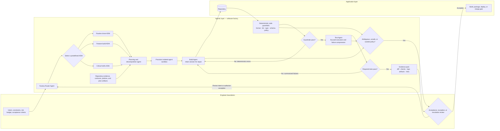

# Agentic Software Factory

AgentSwitchboard is being developed as an **agentic engineering** system, not as a collection of chat loops. Its purpose is to move routine coding execution into repeatable **AI Developer Workflows (ADWs)** while keeping engineers at the highest-leverage boundaries: defining intent and constraints, authorizing exceptions, and accepting evidence-backed results.

This does **not** mean removing humans from accountability. It means removing humans from the repetitive implementation loop whenever agents and deterministic code can perform that work safely, observably, and at lower cost.

## Canonical workflow

The standalone Mermaid source is maintained at [`diagrams/agentic-software-factory.mmd`](../../diagrams/agentic-software-factory.mmd).

## The three actors

### Engineers

Engineers own the constraints that should not be guessed:

- desired outcome and acceptance criteria;
- risk, cost, privacy, and deployment boundaries;
- approval of policy exceptions;
- final acceptance when consequences justify human review;
- design and continuous improvement of the factory itself.

The target is not to keep an engineer inside every edit-test-repair cycle. The target is to make the engineer responsible for **governance and factory design**, rather than routine keystrokes.

### Agents

Agents perform work requiring contextual reasoning or generation:

- classify incoming work;
- select the appropriate predefined ADW;
- gather repository evidence;
- plan and decompose bounded work;
- implement changes;
- interpret failures;
- produce repairs while retaining session context;
- compress test results and prepare evidence for acceptance.

Agents are not treated as deterministic validators. They operate inside bounded workflows and must expose their actions and evidence.

### Deterministic code

Code performs checks and transformations that should not consume model tokens or vary between runs:

- formatting and linting;
- type, schema, and policy validation;
- test execution;
- artifact registration;
- Git-state inspection;
- secret and scope checks;
- report rendering;
- routing conditions with explicit rules.

Whenever a reliable program can perform a step, the factory should prefer code over another agent turn. Failure output is sent back to the responsible agent, ideally with the same session identifier so it can repair the work without losing context.

## Workflow contracts

Every production ADW should define:

1. **Trigger and routing rule** — what work enters the workflow and why this ADW is selected.
2. **Input contract** — ticket, repository, branch, scope, forbidden scope, acceptance criteria, and available evidence.
3. **Isolation contract** — sandbox or worktree ownership, resource limits, and parallel-write boundaries.
4. **Agent roles** — planning, building, testing, review, or specialist roles with bounded authority.
5. **Deterministic gates** — commands, validators, schemas, and policies that decide whether work advances.
6. **Repair routing** — which failures return to which agent, with session continuity where possible.
7. **Escalation rule** — the conditions that require an engineer rather than another autonomous retry.
8. **Evidence contract** — diffs, logs, reports, artifacts, skipped checks, risks, and final Git state.
9. **Completion gate** — the proof required before merge, deployment, or human acceptance.
10. **Recovery boundary** — checkpoints that preserve coherent work before expensive validation or broader expansion.

## Scaling path

AgentSwitchboard should mature through observable stages rather than jumping directly to unbounded autonomy:

| Stage | Factory capability | Human position |
|---|---|---|
| 0 | Engineer prompts one agent and manually reviews the result | Inside most steps |
| 1 | Deterministic format, lint, type, schema, and policy gates | Reviews failures and output |
| 2 | Specialized test agent interprets and compresses validation | Handles exceptions and acceptance |
| 3 | Isolated sandboxes enable safe parallel workflows | Governs concurrency and risk |
| 4 | Factory router selects predefined ADWs for chores, features, and hotfixes | Defines routing and policy |
| 5 | Evidence-backed workflows run routine coding end to end | Sets intent, reviews escalations, accepts outcomes |

The desired direction is **less human involvement in coding execution**, not less human ownership of engineering outcomes.

## Design rules

- **Design the workflow by hand first.** Execute every node manually until inputs, dependencies, failure states, and evidence are understood.
- **Keep deterministic code separate from agent skills.** Skills explain capabilities and interaction patterns; executable logic belongs in scripts, modules, validators, and services.
- **Route failures, not prose.** Give agents exact command output, structured errors, and artifact references.
- **Retain repair context.** Reuse the responsible agent session when a deterministic gate reports a correctable failure.
- **Isolate before parallelizing.** Every writing agent needs an owned sandbox or worktree and explicit forbidden scope.
- **Prefer predefined ADWs.** The router selects a reviewed workflow; it does not invent unlimited authority for each ticket.
- **Checkpoint before expansion.** Preserve the first coherent tracked change before broad tests, long diagnostics, runtime proof, or larger refactoring.
- **Evidence before confidence.** Completion requires passing checks, expected artifacts, Git-state proof, and honest reporting of gaps.
- **Escalate uncertainty.** Security, ambiguous intent, destructive operations, policy exceptions, and repeated failed repairs return to an engineer.

## Relationship to AgentSwitchboard

AgentSwitchboard is the control plane for this factory. It should eventually provide:

- agent and provider selection without coupling workflows to one vendor;
- prompt and skill delivery as versioned inputs;
- sandbox and worktree provisioning;
- predefined ADW manifests;
- deterministic command execution and validation gates;
- session-aware repair routing;
- artifact and evidence registries;
- quota, cost, failure, and provider classification;
- human escalation and acceptance surfaces.

Application code is the product produced by the factory. The **agentic layer** is the product AgentSwitchboard engineers directly.

## Source influence

This architecture adapts the ideas described by IndyDevDan in the video **“Stop Loop Engineering. Start Agentic Engineering.”** The source emphasizes three actors—engineers, agents, and code—and develops the progression from a basic engineer-agent-review flow through deterministic guardrails, specialized test agents, isolated sandboxes, and factory-level routing.

Relevant source sections supplied for this design review:

- `03:38–04:43` — engineers, agents, and deterministic code;
- `04:50` — basic engineer-agent-review workflow;
- `06:02–07:35` — formatter, linter, type-checker, and repair gates;
- `07:40` — specialized test agent;
- `10:42–11:15` — isolated agent sandboxes;
- `12:02–18:00` — factory router and workflow selection;
- `26:39–32:00` — separation of code and skills, manual design first, meta-engineering, and Mermaid mapping.

Reference: <https://www.youtube.com/watch?v=VQy50fuxI34&t=1107s>
